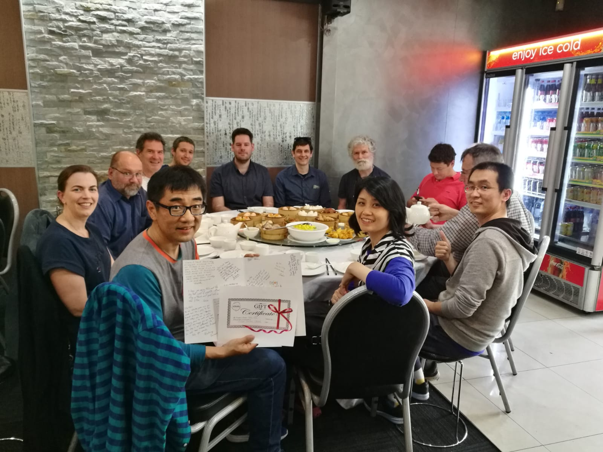
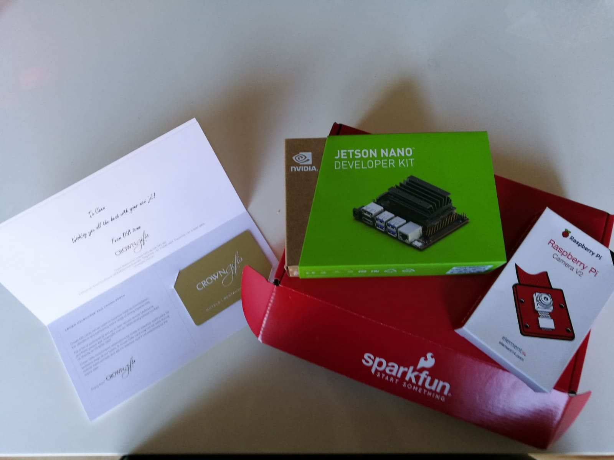
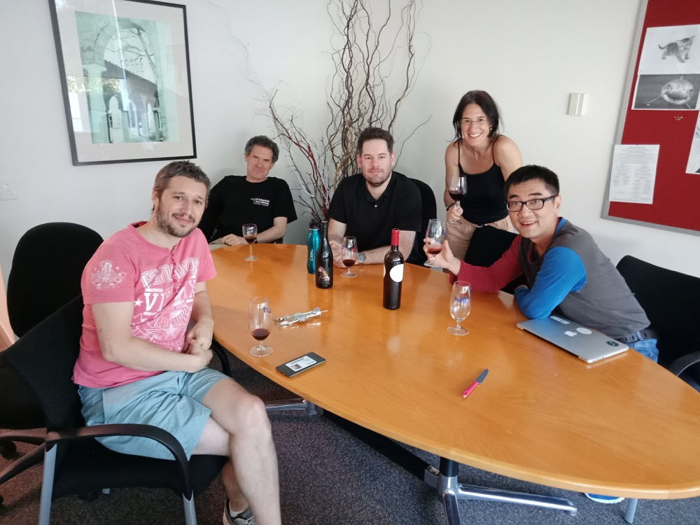

.. daliuge documentation master file, created by
   sphinx-quickstart on Mon Feb  8 16:19:47 2016.
   You can adapt this file completely to your liking, but it should at least
   contain the root `toctree` directive.

MyAlbum
#########

Welcome to MyAlbum! I wanted to take a moment to let you know how much I’ve enjoyed my time here. 
So I have compiled some pictures mostly taken by my phone, and share them with you to remember the past awesome 8.5 years.

On the left panel, you will see high level categories named after |daliuge| concepts. 
On this page, you will find three farewell pictures and a table of content. 

All pictures are clickable to enlarge but with the same resolution.

    Farewell lunch in an "unplanned" location

Look what have I got?

    This is surreal! A big "thank you" to everyone!

    Farewell drinks at the DIA kitten area, and we had such a GREAT time!

.. toctree::
 :maxdepth: 2

 intro
 installing
 overview
 graph_development
 writing_an_application
 examples
 api-index

.. _ICRAR: http://www.icrar.org
