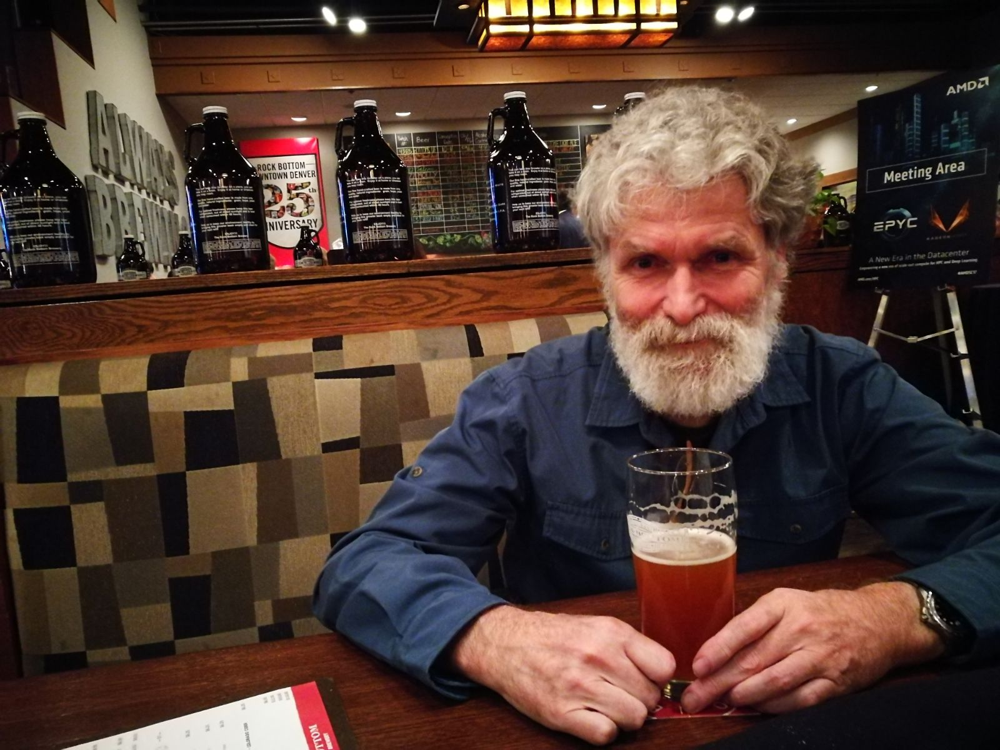

.. _intro:

Introduction
============
I am going to show some randomly shuffled pictures to reduce your expectation biases.

CNY Lunch
-------------
We more or less kept the tradition of going to Dim Sum during the Chinese New Year.

    2015 Chinese new year Dim Sum after watching Giants in the street. Ian was not full at all in the end...

B____ meeting
-------------

My boss is genuinely happier in front of b______
    
    A. black holes
    B. binary stars
    C. block chains
    D. blue cheese

    None of the above apparently!

Training overseas
-------------------
We delivered HPC and NGAS courses to radio astronomers on our first trip to Chiang Mai.

    2017 Chiang mai training. The food was pretty amazing. Please use your imagination here...

NGAS running!
-------------
Always exciting to see NGAS just "worked" out of the box, particularly for a new radio telescope.

    2016 NGAS archived the first file at the FAST telescope site. The screen shows that it was even a proper
    archive command that handled the FITS extension properly.

UWA 100 years
--------------
This was back in 2013, when UWA had the Centenary celebration (I think?)

    I shot this from the Reid library in case you wonder where I was.

Year of the Rooster
---------------------

    Inspirations for developing `DALiuGE <https://github.com/ICRAR/daliuge>`_. 
    I remember celebrating Year of the Rooster just a few days after I arrived in Perth/Australia
    for the first time!

We give a glimpse to what's gonna happen in the next few sections. Enjoy!
