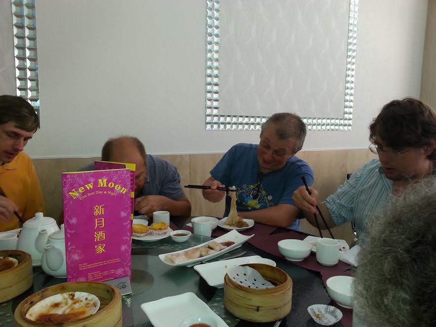
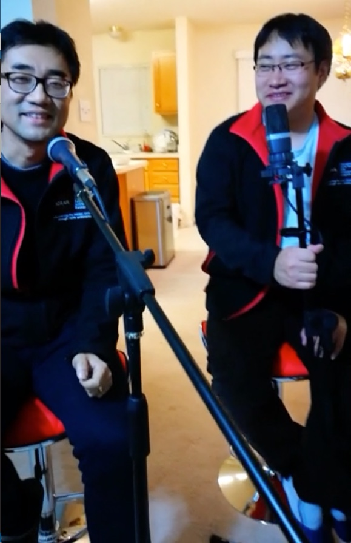
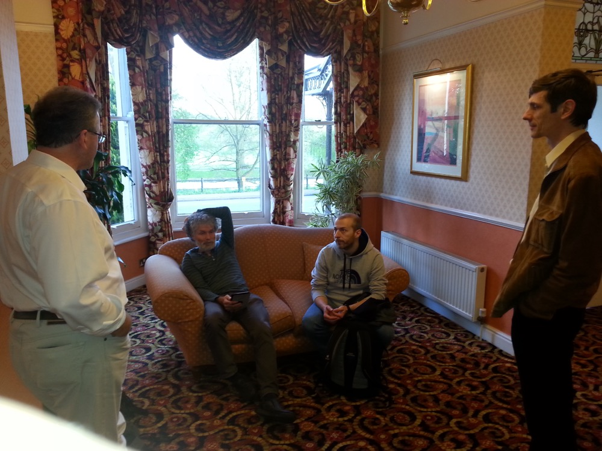
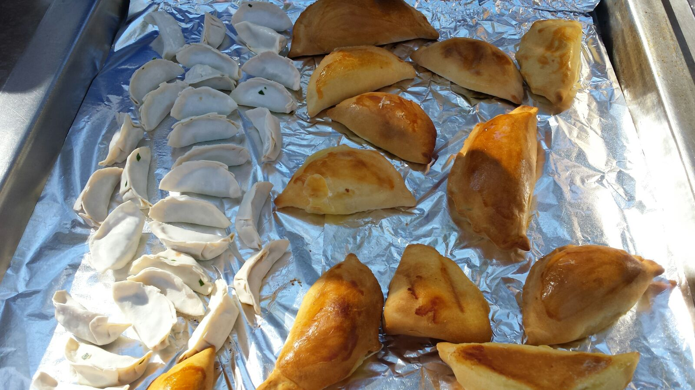
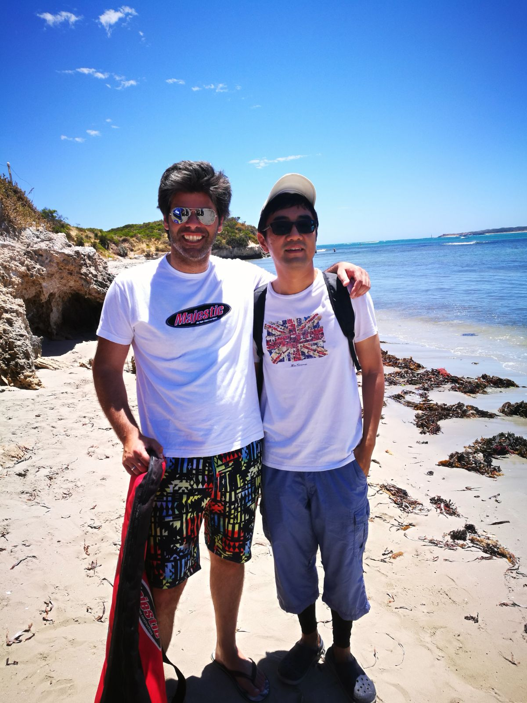
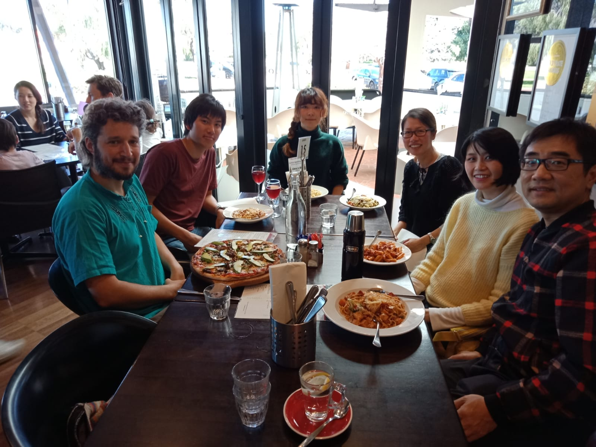

Overview
========

The following sections give an overview of the different modules present in
DALiuGE.

Rice flour rolls
-----------------

I told Kevin they are gluten free, or are they?

    Who is having chicken feet behind the menu? BTW, New Moon was still there back in 2014

Cross-Pacific collaboration
-------------------------------

It went well I can tell you!

    We were singing "the Blue and White Porcelain"

Meeting in the Northern Hemisphere
--------------------------------

What is our strategy?

    Looking at the map: where is the pub?

More dumplings
-------------------

of different sizes

    A mixture of C^2 (Chinese and Chilean)

Diving trip
-------------------

I was a first time beginner

    Just like neural networks - always go deeper!

Lunch break
-------------------

Great collaborations!

    Should have ordered Pizza because that plate looks much bigger!

